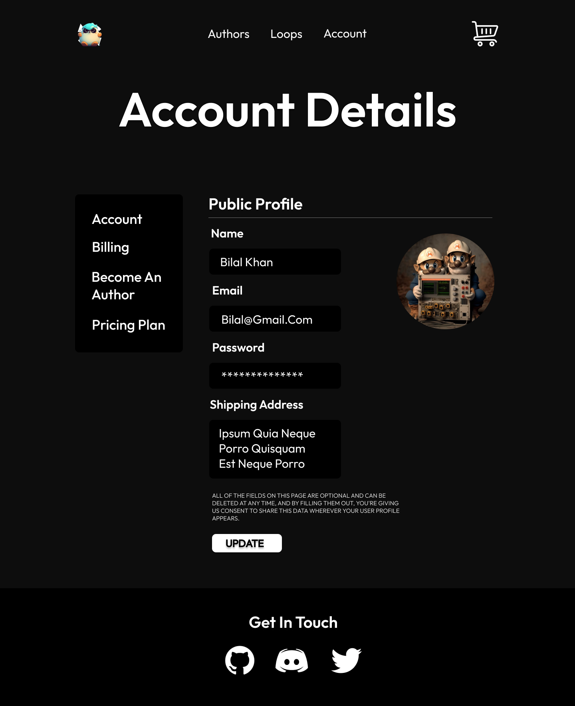
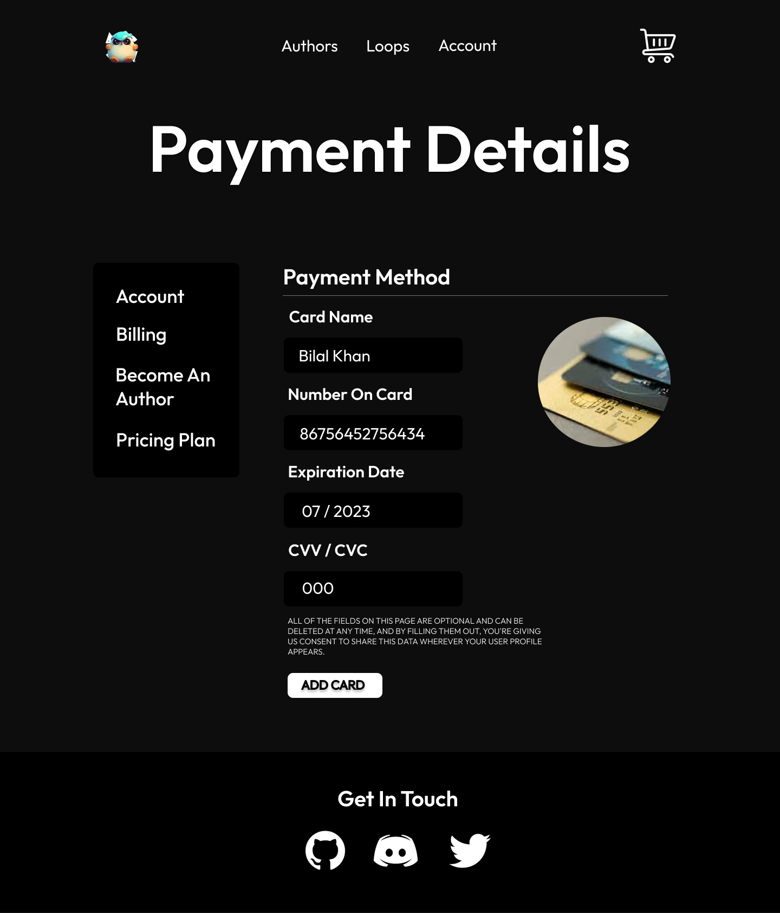
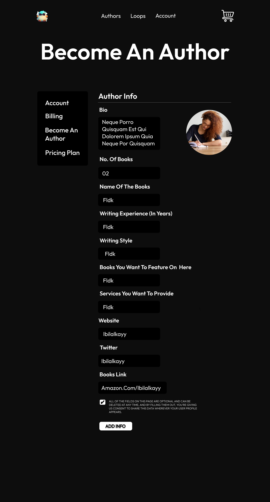

# **Account Page**

## **Here is the account page**

This is the account page that takes 

- Name
- Email
- Password
- Shipping Address

 
    

# **Billing Page**

This is the login page that takes

- Card Name
- Number on Card
- Expiration Date
- CVV / CVC 

## **Here is the billing page**

 
    

# **Becoming an Author Page**

This is the login page that will take

- Bio
- Number of Books
- Name of the Books
- Writing Experience
- Writing Style
- Books to Feature on
- Services to Provide
- Website
- Twitter / Socials
- Book Links

## **Here is the page of becoming an author**

 
    

