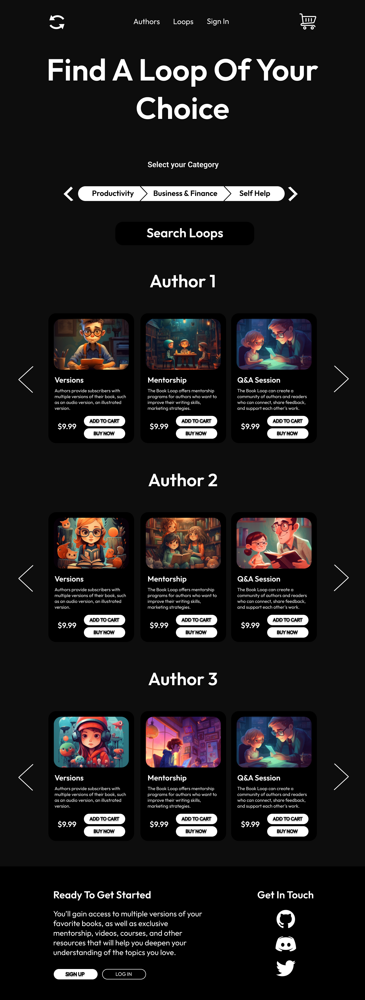

# **Authors Page**

This is the authors page that contains

- Search Authors
- Authors Section

## **Here is the authors page**

 
    

# **Books Page**

This is the books page that contains

- Search Books
- Books Section

## **Here is the books page**

 
    

# **Loops Page**

This is the loops(services) page that contains

- Search Loops
- Loops Section

## **Here is the book's page**

 
    

