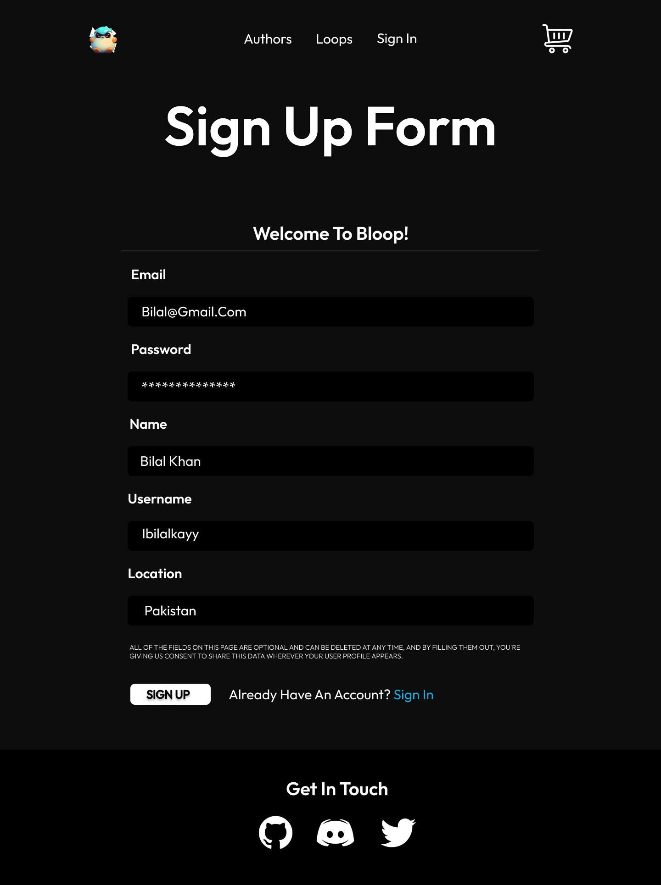
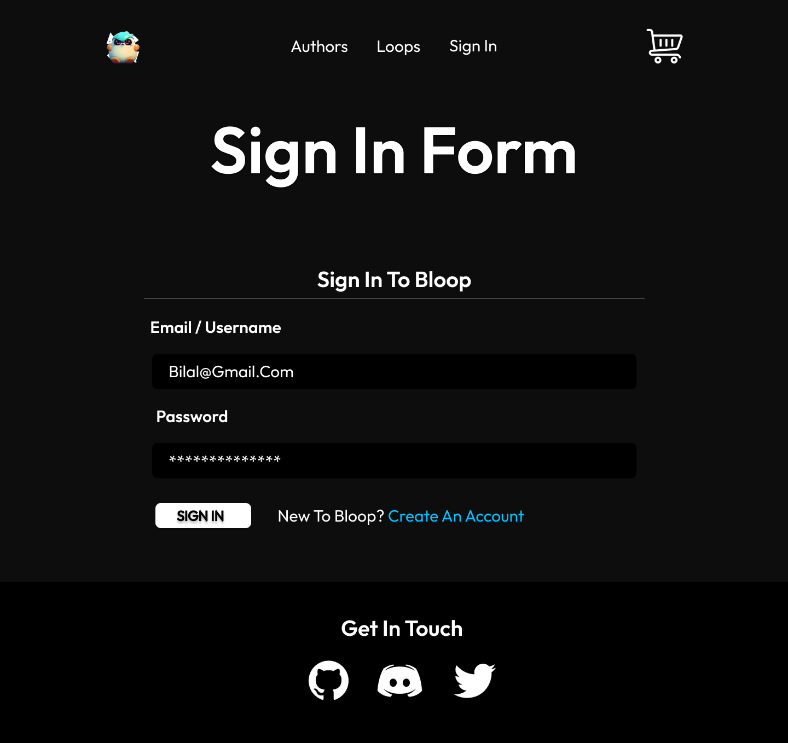

# **Signup Page**

This is the signup page that will take 

- Email address
- Password
- Name
- Username
- Location

## **Here is the signup page**

 
    

# **Login Page**

This is the login page that will take

- Email address / Username
- Password

## **Here is the login page**

 
    

